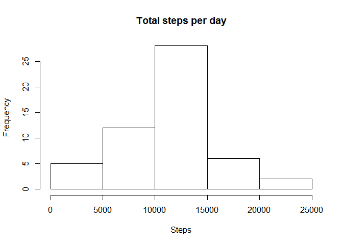
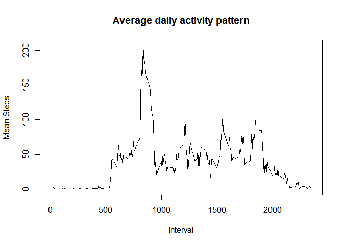
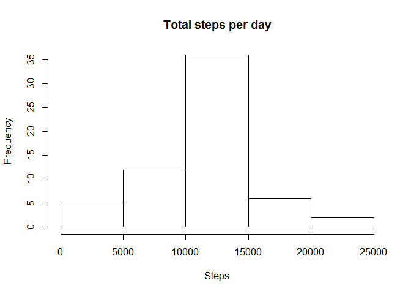
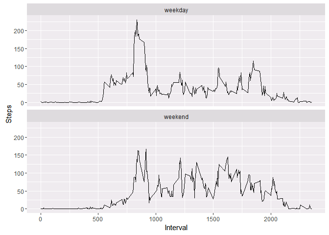

1. Loading the data
-------------------

    activity<-read.csv("activity.csv")
    head(activity)

    ##   steps       date interval
    ## 1    NA 2012-10-01        0
    ## 2    NA 2012-10-01        5
    ## 3    NA 2012-10-01       10
    ## 4    NA 2012-10-01       15
    ## 5    NA 2012-10-01       20
    ## 6    NA 2012-10-01       25

2. Mean total number of steps taken per day
-------------------------------------------

### Total Steps:

    totalsteps<-aggregate(activity$steps,list(activity$date),sum)
    names(totalsteps)<-c("Date", "Total Steps")
    head(totalsteps)

    ##         Date Total Steps
    ## 1 2012-10-01          NA
    ## 2 2012-10-02         126
    ## 3 2012-10-03       11352
    ## 4 2012-10-04       12116
    ## 5 2012-10-05       13294
    ## 6 2012-10-06       15420

### Histogram for total steps per day:

    hist(totalsteps$`Total Steps`,main="Total steps per day", xlab="Steps")

### mean and median of the total number of steps taken per day

    summary(totalsteps)

    ##          Date     Total Steps   
    ##  2012-10-01: 1   Min.   :   41  
    ##  2012-10-02: 1   1st Qu.: 8841  
    ##  2012-10-03: 1   Median :10765  
    ##  2012-10-04: 1   Mean   :10766  
    ##  2012-10-05: 1   3rd Qu.:13294  
    ##  2012-10-06: 1   Max.   :21194  
    ##  (Other)   :55   NA's   :8

3. The average daily activity pattern
-------------------------------------

    meaninterval<-aggregate(activity$steps,list(activity$interval),mean,na.rm=TRUE)
    names(meaninterval)<-c("Interval","Mean")
    plot(meaninterval$Interval,meaninterval$Mean,type = "l",main="Average daily activity pattern", xlab="Interval",ylab="Mean Steps")

### Maximum number of steps in an interval

    subset(meaninterval$Interval,meaninterval$Mean==max(meaninterval$Mean))

    ## [1] 835

3. Imputing missing values
--------------------------

### Calculate the number of missing values

    sum(is.na(activity))

    ## [1] 2304

### Filling the missing values

    activityna<-activity
    i<-nrow(activity)

    for (j in 1:i)
    {
      if(is.na(activityna$steps[j]))
      {
        k<-activityna$interval[j]
        
        activityna$steps[j]<-subset(meaninterval$Mean,meaninterval$Interval==k)
      }
      
      
    }

### histogram of the total number of steps taken each day

    totalstepsnew<-aggregate(activityna$steps, list(activityna$date),sum)
    names(totalstepsnew)<-c("Date","Total Steps")
    hist(totalstepsnew$`Total Steps`,main="Total steps per day", xlab="Steps")

### New Mean and Median

    mean(totalstepsnew$`Total Steps`)

    ## [1] 10766.19

    median(totalstepsnew$`Total Steps`)

    ## [1] 10766.19

### Old Mean and Median

    mean(totalsteps$`Total Steps`,na.rm=TRUE)

    ## [1] 10766.19

    median(totalsteps$`Total Steps`,na.rm=TRUE)

    ## [1] 10765

Median values are slightly different and mean values are exactly the
same

4.Calculate Weekdays and Weekends
---------------------------------

    week<-0
    for (i in 1:nrow(activityna))
    {
      week[i]<-weekdays(as.Date(activityna$date[i]))
      if(week[i] %in% c("Saturday","Sunday") )
      {
        week[i]<-"weekend"
      }
      else {
        week[i]<- "weekday"
      }
        
      
    }
    activitynew<-cbind(activityna,week)

### Calculate the aggregation

    meanstepsweek<-aggregate(activitynew$steps, list(activitynew$week,activitynew$interval),mean)
    names(meanstepsweek)<-c("Week","Interval","Steps")

### Plot data on weekdays vs weekends

    library(ggplot2)
    g<-ggplot(meanstepsweek,aes(Interval,Steps))
    g+geom_line()+facet_wrap(~Week,ncol=1)

